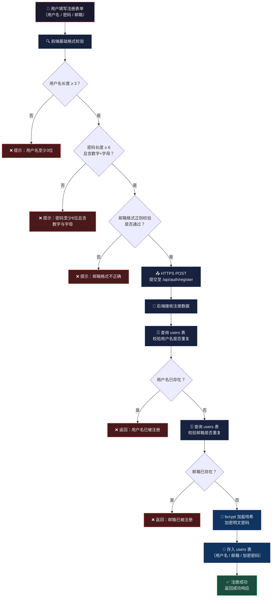

# 用户注册流程

## 流程说明

| 阶段 | 步骤 | 说明 |
|------|------|------|
| **前端校验** | ① 用户名长度 | ≥ 3 位，否则拦截 |
| | ② 密码强度 | ≥ 6 位 + 必须同时包含数字和字母 |
| | ③ 邮箱格式 | 正则校验格式合法性 |
| **网络传输** | ④ HTTPS POST | 加密传输至 `/api/auth/register` |
| **后端校验** | ⑤ 用户名查重 | 查询 `users` 表，存在则拒绝 |
| | ⑥ 邮箱查重 | 查询 `users` 表，存在则拒绝 |
| **密码加密** | ⑦ bcrypt 加盐哈希 | 对明文密码加随机盐后哈希 |
| **数据持久化** | ⑧ 写入 users 表 | 存储用户名、邮箱、加密后的密码 |
| **响应** | ⑨ 返回结果 | 成功 / 失败信息返回前端 |
